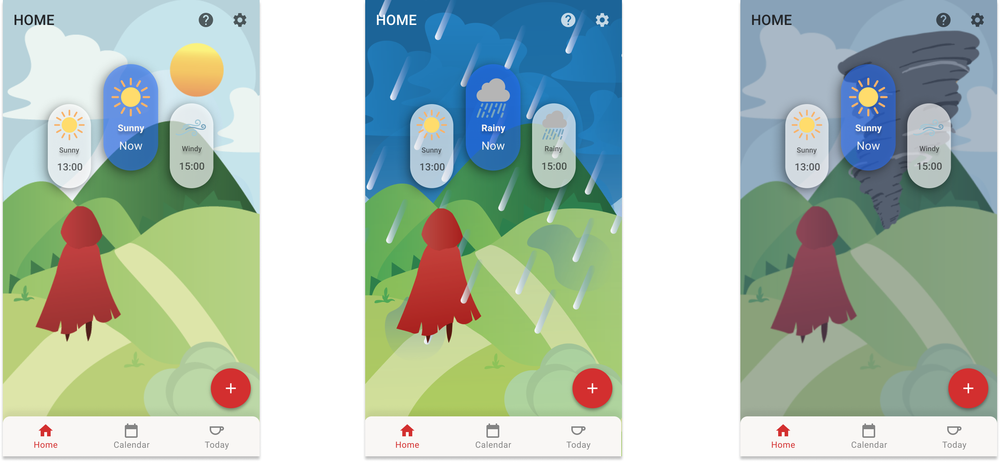
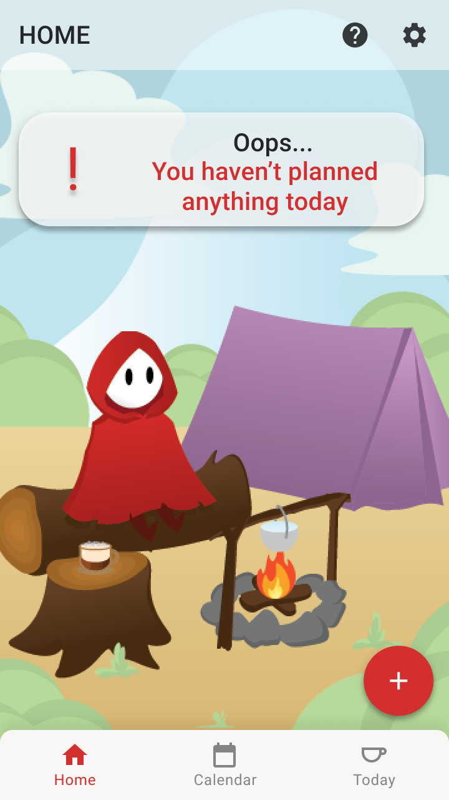
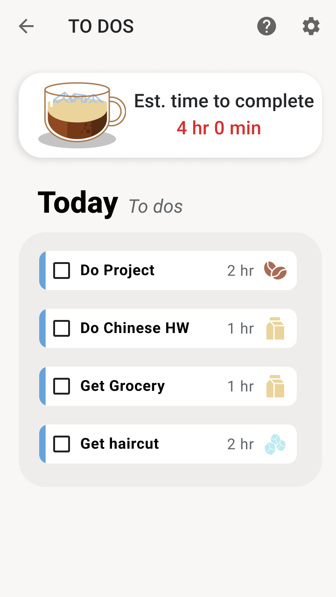
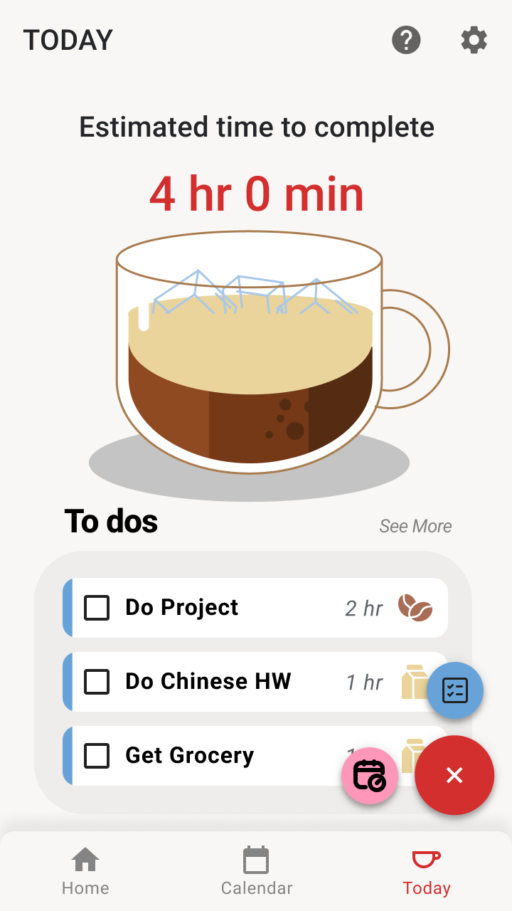
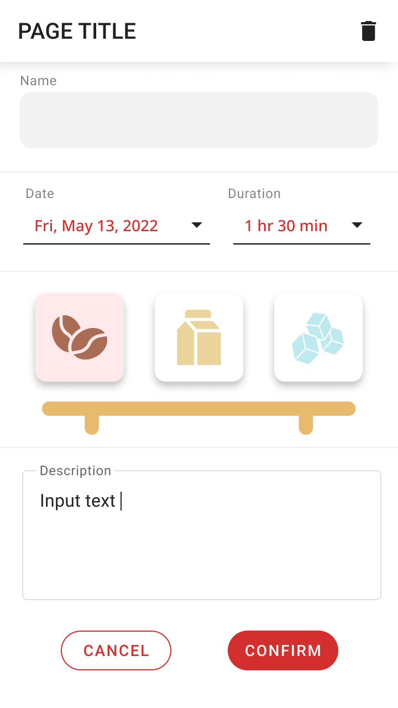

# Lifeline

Lifeline is a simple todo app, based on durations and deadlines built with [Jetpack Compose][compose].

To try out this sample app, use the latest stable version
of [Android Studio](https://developer.android.com/studio).
You can clone this repository or import the
project from Android Studio following the steps
[here](https://developer.android.com/jetpack/compose/setup#sample).

Using:

* Dependency Injection
* Jetpack Compose Canvas
  
## Screenshots

### Home Page

### Overview

  
   
  

Figma Hifi: https://www.figma.com/file/VlXV8bcJuupdgdV3IvUVcW/Hi-Fi-Prototype?node-id=0%3A1
